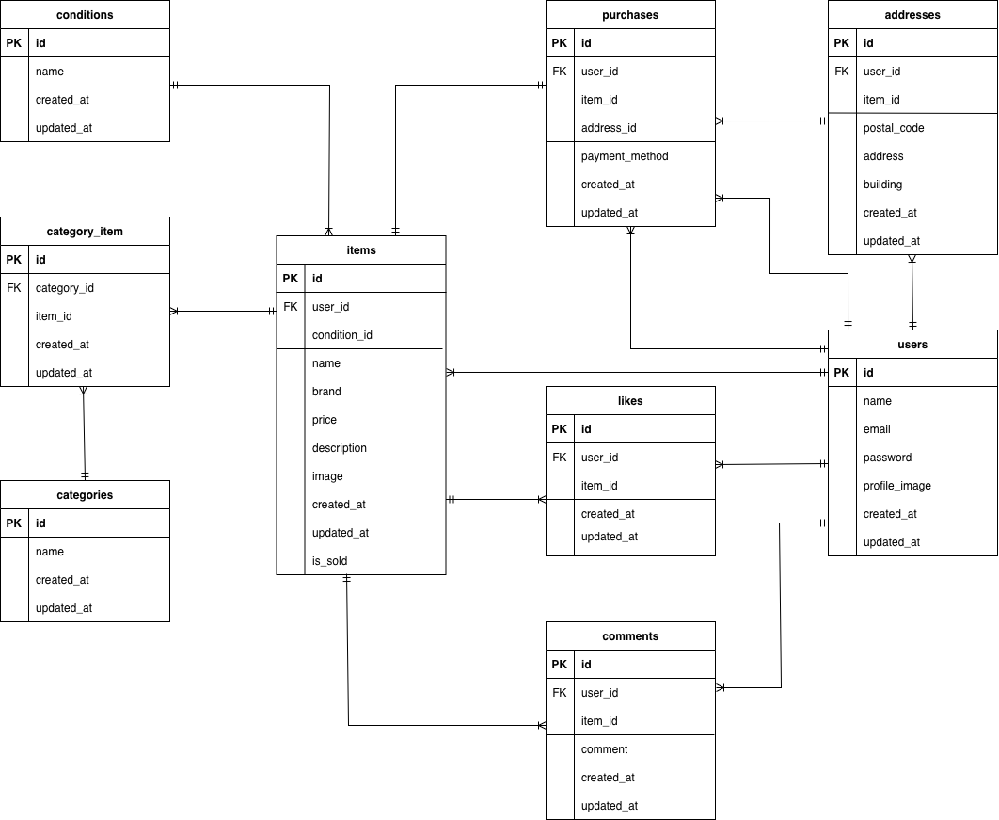

# coachtechフリマ
## 環境構築
### dockerビルド
1. `git clone https://github.com/ayadoon0720-cpu/coachtech-fleamarket.git`
2. `cd coachtech-fleamarket`
3. DockerDesktopアプリを立ち上げる
4. `docker-compose up -d --build`
### Laravel環境構築
1. `docker-compose exec php bash`
2. `composer install`
3. `cp .env.example .env`
4. 「.env」ファイルの一部を以下のように編集
```
DB_CONNECTION=mysql
DB_HOST=mysql
DB_PORT=3306
DB_DATABASE=laravel_db
DB_USERNAME=laravel_user
DB_PASSWORD=laravel_pass
```
```
MAIL_MAILER=smtp
MAIL_HOST=mailhog
MAIL_PORT=1025
MAIL_USERNAME=null
MAIL_PASSWORD=null
MAIL_ENCRYPTION=null
MAIL_FROM_ADDRESS=test@example.com
MAIL_FROM_NAME="FleaMarket"
```
```
STRIPE_KEY=pk_test_xxxxx
STRIPE_SECRET=sk_test_xxxxx
※StripeのAPIキーは各自で取得してください。
```
6. アプリケーションキーの作成
```
php artisan key:generate
```
8. マイグレーションの実行
```
php artisan migrate
```
10. シーディングの実行
```
php artisan migrate:fresh --seed
```
11. シンボリックリンク作成
```
php artisan storage:link
```
## userのログイン用初期データ
- メールアドレス：hanako@test.com
- パスワード：password
## 使用技術(実行環境)
- PHP8.1.34
- Laravel8.83.8
- MySQL8.0.36
## ER図

## 開発環境
- 商品一覧画面：http://localhost/
- 会員登録画面：http://localhost/register
- phpMyAdmin：http://localhost:8080/
## テスト概要
本アプリでは、会員登録・ログイン・商品購入などの主要機能について、正常系・異常系のテストを実施しています。
## テスト環境
1. テスト用データベースの作成(MySQL)
```
docker-compose exec mysql bash
mysql -u root -p
```
パスワードは「docker-compose.yml」ファイルの`MYSQL_ROOT_PASSWORD:`に設定されている`root`を入力する。
パスワード入力後：
```
CREATE DATABASE demo_test;
SHOW DATABASES;
```
2. 「database.php」ファイルの`'mysql' => [ // 中略 ],`の下に以下の項目を追加
```
'mysql_test' => [
        'driver' => 'mysql',
        'url' => env('DATABASE_URL'),
        'host' => env('DB_HOST', '127.0.0.1'),
        'port' => env('DB_PORT', '3306'),
        'database' => 'demo_test',
        'username' => 'root',
        'password' => 'root',
        'unix_socket' => env('DB_SOCKET', ''),
        'charset' => 'utf8mb4',
        'collation' => 'utf8mb4_unicode_ci',
        'prefix' => '',
        'prefix_indexes' => true,
        'strict' => true,
        'engine' => null,
        'options' => extension_loaded('pdo_mysql') ? array_filter([
          PDO::MYSQL_ATTR_SSL_CA => env.       ('MYSQL_ATTR_SSL_CA'),
        ]) : [],
],
```
3. テスト用「.env」ファイルの作成
```
docker-compose exec php bash
cp .env .env.testing
```
4. 「.env.testing」ファイルの文頭部分にある`APP_ENV`と`APP_KEY`を以下のように編集
```
APP_ENV=test
APP_KEY=
```
5. 「.env.testing」ファイルのDB設定を以下のように編集
```
DB_CONNECTION=mysql_test
DB_HOST=mysql
DB_PORT=3306
DB_DATABASE=demo_test
DB_USERNAME=root
DB_PASSWORD=root
```
6. 新たなテスト用のアプリケーションキーを追加
```
php artisan key:generate --env=testing
```
7. マイグレーションの実行
```
php artisan migrate --env=testing
```
8. 「phpunit.xml」ファイルの`DB_CONNECTION`と`DB_DATABASE`を以下のように編集
```
<server name="DB_CONNECTION" value="mysql_test"/>
<server name="DB_DATABASE" value="demo_test"/>
```
9. テストファイルの作成
```
php artisan make:test HelloTest
```
## テスト手順
本アプリでは、以下の機能について「テストケース一覧」に基づきテストを実施しました。
### 主なテスト対象機能
- 会員登録機能
- メール認証機能
- ログイン機能
- ログアウト機能
- 商品一覧取得
- マイリスト一覧取得
- 商品検索機能
- 商品詳細情報取得
- いいね機能
- コメント送信機能
- 商品購入機能
- 支払い方法選択機能
- 配送先変更機能
- ユーザー情報取得
- ユーザー情報変更
- 出品商品情報登録
### 会員登録機能
#### 正常系
1. 会員登録ページにアクセスする
2. 名前・メールアドレス・パスワードを入力する
3. 登録ボタンを押す
4. メール認証誘導画面に遷移する
5. メール認証誘導画面の「認証はこちらから」ボタンを押す
6. メール認証サイト(mailhog)に遷移する
7. メール認証サイト(mailhog)のメール認証を完了する
8. プロフィール設定画面に遷移する
#### 異常系
- 名前未入力で登録 → 「お名前を入力してください」と表示される
- メールアドレス未入力で登録→ 「メールアドレスを入力してください」と表示される
- パスワード未入力で登録 → 「パスワードを入力してください」と表示される
- パスワードが7文字以下で登録 → 「パスワードは8文字以上で入力してください」と表示される
- 確認用パスワードと不一致で登録 → 「パスワードと一致しません」と表示される
### ログイン機能
#### 正常系
1. ログインページにアクセス
2. 正しいメールアドレスとパスワードを入力
3. ログインボタンを押す
4. ログインできることを確認
#### 異常系
- メールアドレス未入力でログイン → 「メールアドレスを入力してください」と表示される
- パスワード未入力でログイン → 「パスワードを入力してください」と表示される
- 間違った情報でログイン → 「ログイン情報が登録されていません」と表示される
### 商品購入機能
#### 正常系
1. ログインする
2. 商品一覧ページを開く
3. 商品を選択して商品詳細ページへ遷移
4.「購入する」ボタンを押す
5. 購入完了することを確認
6. 商品に「Sold」と表示される
7. プロフィールの購入した商品一覧に追加される
#### 確認事項
- 購入後、プロフィールの購入した商品一覧に追加されていること
- 購入した商品が商品一覧画面で「sold」と表示されていること
### いいね機能
#### 正常系
1. ログインする
2. 商品詳細ページを開く
3. いいねアイコンを押す
4. いいねが登録されることを確認
5. 再度押すと解除されることを確認
#### 確認事項
- いいねアイコンが押下された状態では色が変化すること
- いいねアイコンが押下されるといいね合計値が増加表示されること
- いいねが解除されるといいね合計値が減少表示されること
- いいねアイコンを押下することで、商品一覧画面のマイリストに登録されること
### テスト結果
各機能について、正常系および異常系のテストを実施し、「テストケース一覧」に記載された期待挙動を満たしていることを確認しました。
